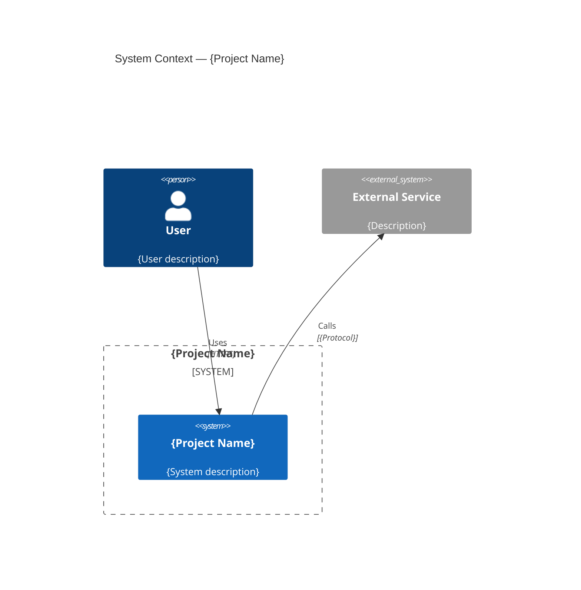
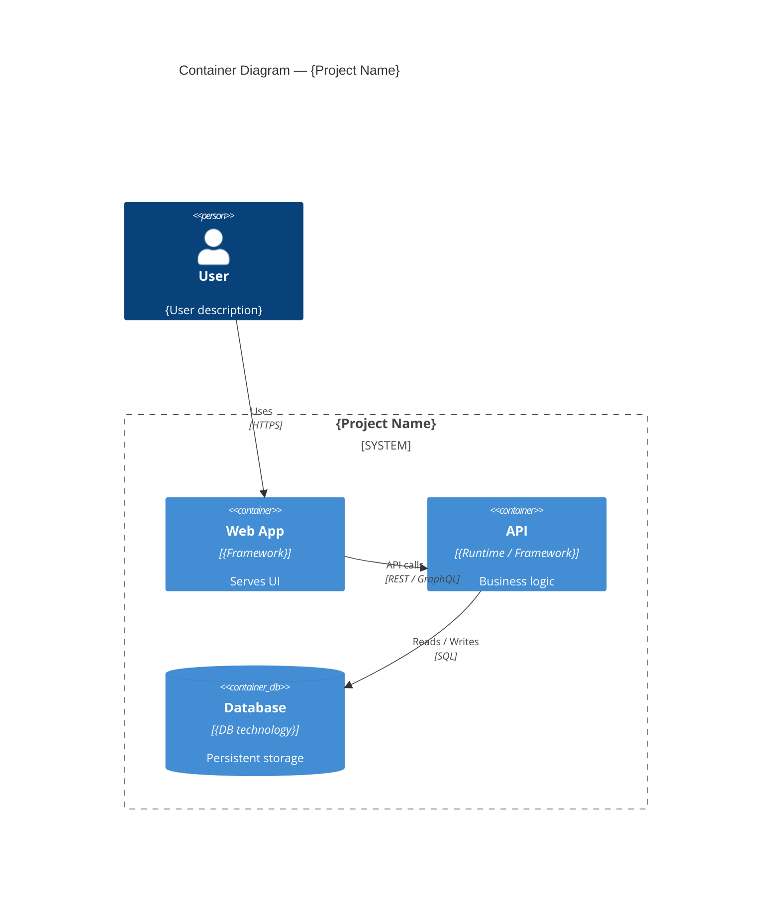
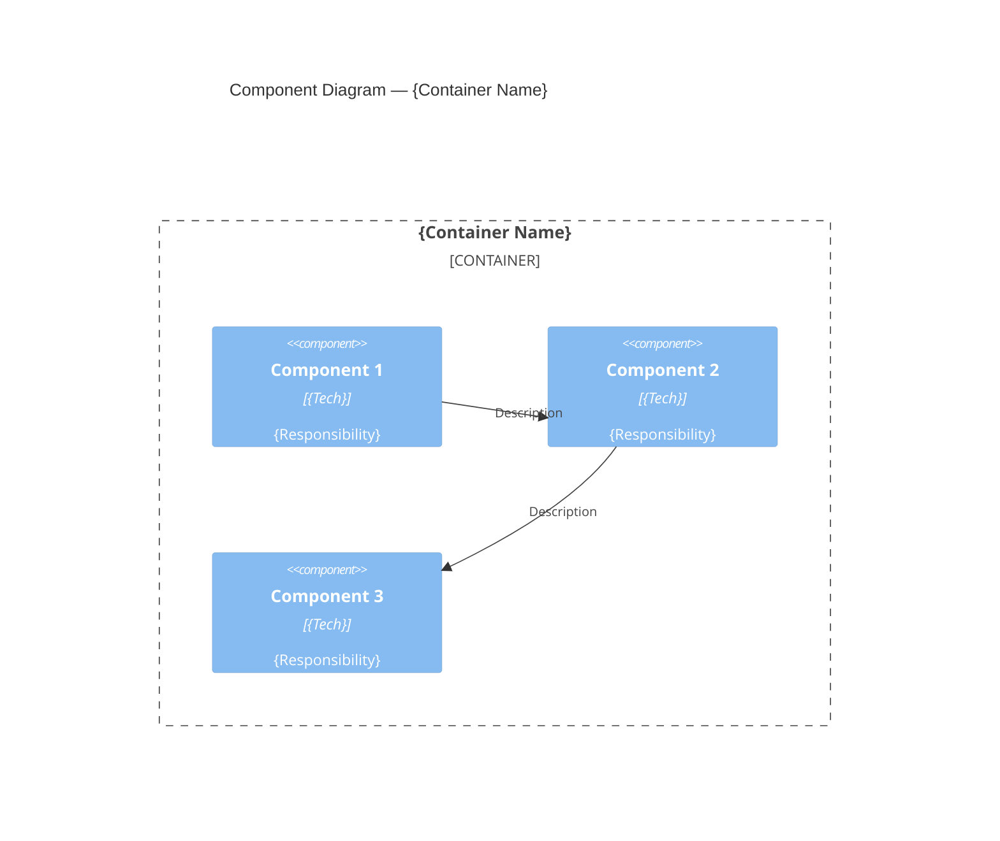

# {Project Name} — Architecture

<!--
  This template is used by the jumpstart-project skill to produce
  a complete architectural blueprint for a new project.
  Fill in all bracketed placeholders.
-->

## Overview

| Field | Value |
|-------|-------|
| **Project Name** | {Project Name} |
| **Elevator Pitch** | {One-sentence description} |
| **Primary Users** | {Target audience} |
| **Status** | Draft / Approved / In Progress |

---

## Requirements

> Full requirements document: [`{project-name}-requirements.md`](./{project-name}-requirements.md)

### MVP Features
- FR-1: {Description}
- FR-2: {Description}
- FR-3: {Description}

### Key Non-Functional Requirements
- **Performance**: {Target}
- **Security**: {Target}
- **Scalability**: {Target}
- **Availability**: {Target}

---

## C4 Architecture Model

### Level 1 — System Context

Shows the system as a black box, its users, and external dependencies.

### Level 2 — Container Diagram

Shows the high-level technical building blocks.

### Level 3 — Component Diagram

{Optional, only for the most complex container.}

---

## Tech Stack

| Layer | Choice | Rationale |
|-------|--------|-----------|
| **Frontend** | {Framework, UI lib, state management} | {Why it fits} |
| **Backend** | {Runtime, framework} | {Why it fits} |
| **Database** | {Primary DB, cache if applicable} | {Data model fit, scalability} |
| **Infrastructure** | {Hosting, CI/CD, monitoring} | {Deployment strategy} |
| **Auth** | {Auth provider / strategy} | {Security requirements} |

---

---

## Testing Strategy

### Testing Tiers

| Tier | Scope | Responsibility | Framework | Run Frequency | Location |
|------|-------|----------------|-----------|---------------|----------|
| **Unit** | Individual functions, classes, or modules in isolation | Catch logic bugs early; fast feedback | {e.g., Vitest, Jest, pytest, NUnit} | On every save / pre-commit | `{path/to/unit-tests}` |
| **Integration** | Interactions between two or more components (API + DB, service + cache) | Verify contracts and data flow | {e.g., Supertest, Testcontainers, pytest-django} | On every push / CI | `{path/to/integration-tests}` |
| **E2E / UI** | Full user workflows through the deployed system | Validate critical user journeys | {e.g., Playwright, Cypress, Selenium} | On every PR / scheduled | `{path/to/e2e-tests}` |
| **Visual / Snapshot** | Component or page rendering diff detection | Prevent unintended visual regressions | {e.g., Storybook + Chromatic, Percy} | On every PR | `{path/to/visual-tests}` |
| **Static Analysis** | Code-linting, type-checking, security scanning | Enforce code quality and security standards | {e.g., ESLint, TypeScript strict, SonarQube, Trivy} | On every save / CI | `{config files in repo root}` |

### Coverage Targets

| Metric | Minimum Target | Goal |
|--------|---------------|------|
| **Line Coverage** | {e.g., 70%} | {e.g., 85%} |
| **Branch Coverage** | {e.g., 60%} | {e.g., 80%} |
| **Function Coverage** | {e.g., 80%} | {e.g., 90%} |
| **Critical Paths** (E2E) | {e.g., 100% of MVP flows} | {e.g., 100% of MVP flows} |

> Coverage gates are enforced in CI. Drops below the minimum cause the pipeline to fail.

### Testing Infrastructure

| Concern | Choice / Approach |
|---------|------------------|
| **Test Runner** | {e.g., Vitest, Jest, pytest, NUnit} |
| **Code Coverage Tool** | {e.g., c8/istanbul, pytest-cov, Coverlet} |
| **CI Integration** | {e.g., GitHub Actions, GitLab CI, CircleCI} — coverage reports uploaded as artifacts |
| **Test Data / Fixtures** | {e.g., factories via Faker, seed scripts, testcontainers} |
| **Mocking / Stubbing** | {e.g., MSW, unittest.mock, Moq, Testcontainers} |
| **Environment** | {e.g., ephemeral test DB spun up per run, Docker Compose} |
| **Performance / Load Testing** | {e.g., k6, Artillery, Locust} — run {frequency} |
| **Accessibility Testing** | {e.g., axe-core, Pa11y} — integrated into E2E suite |

### Testing Principles

- **Test the behaviour, not the implementation** — prefer testing public contracts over private internals.
- **Arrange-Act-Assert (AAA)** — every test follows the same structure for readability.
- **Deterministic** — tests produce the same result every run; no shared mutable state.
- **Fast by default** — unit tests run in milliseconds; slow tests are isolated to integration/E2E tiers.
- **Fail-fast in CI** — unit tests run first; integration and E2E run only if unit tests pass.

---

## Implementation Phases

### Phase 1: Foundation
**Goal**: Working skeleton with CI/CD, database, auth, and test infrastructure.
| Task | Description |
|------|-------------|
| 1.1 | Scaffold project (monorepo structure) |
| 1.2 | Configure CI/CD pipeline |
| 1.3 | Set up database schema and migrations |
| 1.4 | Implement authentication |
| 1.5 | Set up unit test framework and write initial tests |
| 1.6 | Set up E2E test framework and write smoke tests |
| 1.7 | Deploy to {environment} |
| **Acceptance Criteria** | User can sign up, log in, and see a landing page; unit + E2E tests pass on CI |

### Phase 2: {Feature Name}
**Goal**: {Feature goal}.
| Task | Description |
|------|-------------|
| 2.1 | {Task} |
| 2.2 | {Task} |
| 2.3 | {Task} |
| **Acceptance Criteria** | {Verifiable outcome} |

### Phase 3: {Feature Name}
**Goal**: {Feature goal}.
| Task | Description |
|------|-------------|
| 3.1 | {Task} |
| 3.2 | {Task} |
| **Acceptance Criteria** | {Verifiable outcome} |

### Phase 4: Polish & Production Readiness
**Goal**: Testing, documentation, and production configuration.
| Task | Description |
|------|-------------|
| 4.1 | Documentation (API docs, runbook) |
| 4.2 | Production infrastructure config |
| 4.3 | Monitoring and alerting setup |
| **Acceptance Criteria** | System passes all tests, documented, deployable |

---

## Risks & Mitigations

| Risk | Impact | Likelihood | Mitigation |
|------|--------|------------|------------|
| {Risk} | {High/Medium/Low} | {High/Medium/Low} | {Strategy} |
| {Risk} | {High/Medium/Low} | {High/Medium/Low} | {Strategy} |

---

## Out of Scope

- {Feature explicitly deferred to future versions}
- {Feature that could be considered but is not planned}

---

*Document generated by the jumpstart-project skill.*
