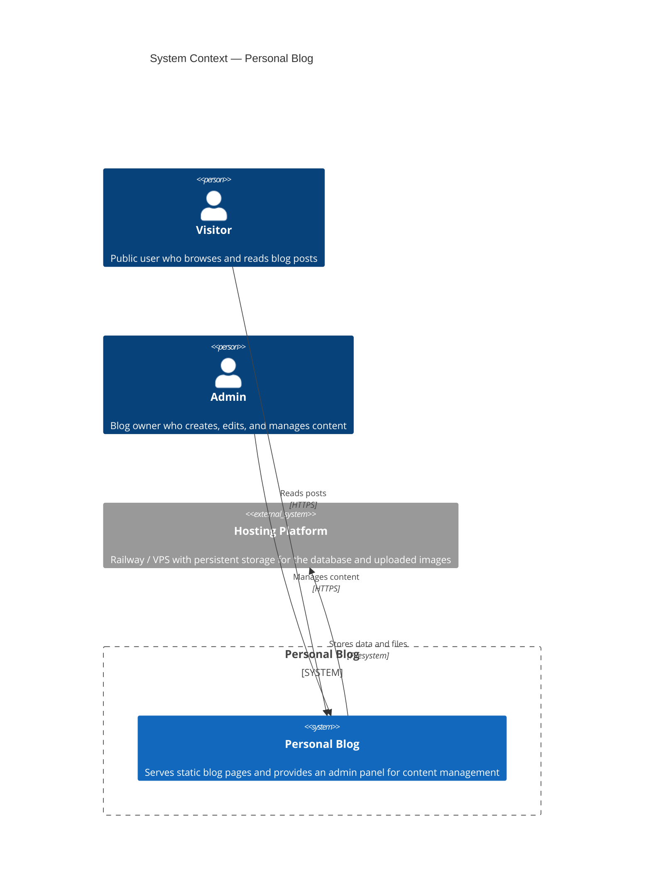
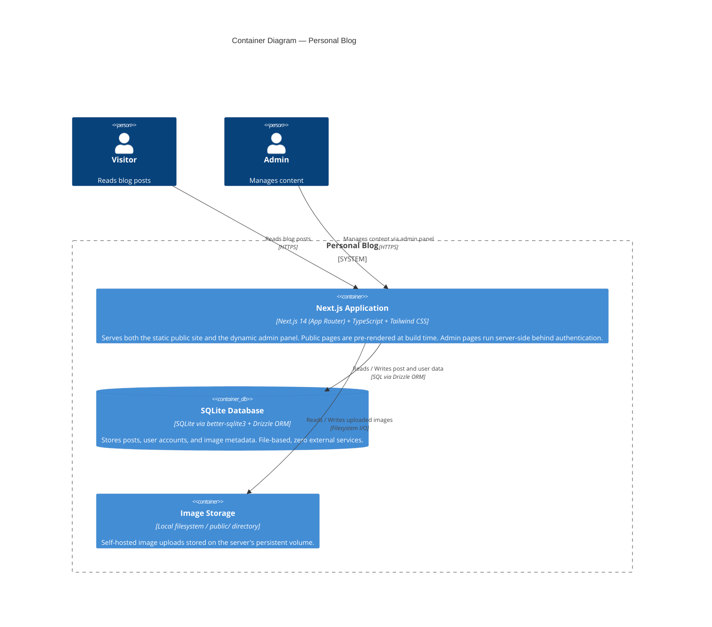
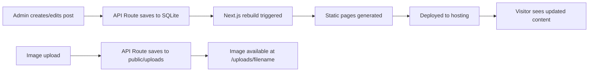

# Jumpstart

Jumpstart is an agentic vibecoding framework for quickly starting and building a new project. There are 2 main phases:

1. **Jumpstart:** Turn your idea into a requirements document, architecture plan, and GitHub repo.
2. **Iterate:** Build your project piece-by-piece using the issue, plan, execute loop.

## Prerequisites

Before using Jumpstart, ensure you have the following:

- **Git** — Installed and configured on your machine
- **GitHub CLI (`gh`)** — Installed and authenticated (`gh auth status`)
- **A compatible AI coding agent** — Such as Claude Code, Cursor, GitHub Copilot, Roo Code, etc.

## Quick Start

Commands prefixed with `/` invoke the corresponding skill in your agent. A skill is a packaged set of instructions that guides the agent through a specific task, such as creating a GitHub issue or generating a planning document.

1. **Setup Jumpstart** — Follow the [Setup](#setup) section to add the required skills to your local project
2. `/jumpstart-project` to create your initial requirements, architecture plan, and GitHub repository
3. `/create-git-issue` to turn an implementation phase, feature, bug, or idea into a GitHub issue
4. `/create-planning-doc` to turn a GitHub issue into a thoroughly documented plan
5. `/execute-plan` to turn a planning doc into a working, tested, and committed code

Repeat steps 3-5 until the project is completed.

## Setup

1. Clone or copy the Jumpstart repository into your local project folder. Ensure the `/.agents` directory is placed at the root of your project.
2. Verify the skills have been picked up by your agent. Different agents expect different directory names (e.g., `.claude`, `.cursor`, `.github/agents`). If the `/.agents` directory isn't being detected, rename it to match your agent's expected name.
3. Use `/jumpstart-project` to create your initial requirements and architecture documents. The agent will likely ask you additional questions to clarify the requirements. It will also pause for your feedback after creating each document. Finally, it will offer to create a new private GitHub repository if you don't have one already.

## Workflow

Repeat this workflow for each implementation phase/feature/bug/task. Each step should be a new agent chat to prevent hallucinations and task creep.

1. `/create-git-issue` — Describe the bug, feature, or task you want completed. The agent writes a draft, asks for your approval, then creates a GitHub issue.
2. `/create-planning-doc` — Reference a GitHub issue number. The agent creates a planning document based on the template and asks for your feedback.
3. `/execute-plan` — Reference a planning document. The agent implements changes in a feature branch and pauses for your approval after testing passes. If approved, it merges the changes and cleans up the feature branch.

## Structure

Jumpstart is organized into the following directory structure:

```
├── README.md
├── /.agents/
│   ├── rules/          # Agent behavioral rules
│   └── skills/         # Agent skill definitions
├── architecture/       # Requirements & architecture docs
└── planning/           # Implementation planning docs
```

### /.agents/rules

There are only two rules included with Jumpstart, one for basic coding guidelines and the other for enforcing adherence to planning docs. Feel free to add/create any additional rules you'd like.

### /.agents/skills

There are many skills in Jumpstart but most are for guiding the agent through its tasks.

The only skills you need to directly call are the main four: `/jumpstart-project`, `/create-git-issue`, `/create-planning-doc`, and `/execute-plan`.

If you wish to change the format of the requirements, architecture, or planning doc you can modify the template files:
- `/.agents/skills/jumpstart-project/REQUIREMENTS_TEMPLATE.md`
- `/.agents/skills/jumpstart-project/ARCHITECTURE_TEMPLATE.md`
- `/.agents/skills/create-planning-doc/TEMPLATE.md`

### /architecture/

Contains both the architecture and requirements documents created by the `/jumpstart-project` skill. Both documents will be updated by the agent if necessary during the final phase of the `/execute-plan` skill.

### /planning/

Contains the planning documents created by the `/create-planning-doc` skill.

## Tips

- You can bypass using GitHub issues by calling the `/create-planning-doc` with a description of the feature/bug/task request.
- Make git issues story-sized, testable chunks. A good issue scope is a single user-facing feature or bug fix that can be implemented in 1-2 hours of agent work.
- Jumpstart works best when auto-approve is enabled (with proper safety guardrails). Complex plans can take up to an hour to fully implement before asking for user feedback.
- Multi-threading agents is possible but you will need to use git worktrees and plan for dependencies.

## Documentation Examples

Below are examples of the GitHub issues, architecture, and planning docs created automatically by the Jumpstart process.

### Git Issue

User input:

~~~
/create-git-issue add email newsletter feature to my blog
~~~

Output:

~~~
Title: [Feature]: Email newsletter subscription with custom backend and SendGrid/SES delivery
Labels: enhancement

Body:

### User Story
As a blog owner, I want readers to be able to subscribe to an email newsletter so that I can send them updates about new content.

### Acceptance Criteria
- [ ] A subscription form (email input + submit button) is displayed on the blog
- [ ] Submitting a valid email stores it in the database
- [ ] Duplicate emails are handled gracefully (no duplicate subscriptions)
- [ ] An unsubscribe link is included in sent emails
- [ ] Clicking the unsubscribe link removes the subscriber from the list
- [ ] Admin can send newsletters via SendGrid or SES to all active subscribers
- [ ] Basic email template is used for newsletter delivery

### Technical Notes
- Custom backend API with database table for subscribers (id, email, subscribed_at, unsubscribed_at, is_active)
- SendGrid or Amazon SES for email sending
- Single opt-in (no confirmation email required)
- Unsubscribe via token-based link (no login required)
- Consider rate limiting and bounce handling for email delivery
~~~

### Requirements Document

User input:

~~~
/jumpstart-project personal blog website with the ability to create, edit, and delete posts with basic markdown and image support
~~~

Output:

~~~
# Personal Blog — Requirements

## Vision

A lightweight, fast, and publicly accessible personal blog website where the owner can create, edit, and delete posts using a visual WYSIWYG editor that outputs Markdown, with support for self-hosted images — all served as a performant static site.

---

## Actors & Roles

| Role | Description |
|------|-------------|
| **Visitor (Public)** | Unauthenticated user who browses and reads published blog posts, views post lists, and navigates the site. No registration required. |
| **Admin (Owner)** | Authenticated user who creates, edits, deletes, and publishes blog posts. Also manages image uploads. The sole administrative user of the system. |

---

## Functional Requirements (MVP)

| ID | Description | Priority |
|----|-------------|----------|
| FR-1 | **Public Homepage** — Visitors see a paginated list of published blog posts with titles, excerpts, publish dates, and featured images. | Must |
| FR-2 | **Public Post Page** — Visitors can read full blog posts with rendered Markdown content and embedded images. | Must |
| FR-3 | **Admin Authentication** — Admin can log in securely using email/password or OAuth to access the admin panel. | Must |
| FR-4 | **Create Post** — Admin can create a new post via a WYSIWYG editor that outputs Markdown, setting a title, body content, featured image, and publish status (draft/published). | Must |
| FR-5 | **Edit Post** — Admin can edit existing posts, modify all fields, and save changes. | Must |
| FR-6 | **Delete Post** — Admin can delete a post with a confirmation prompt. | Must |
| FR-7 | **Image Upload** — Admin can upload images (JPEG, PNG, GIF, WebP) via the editor, stored server-side. Uploaded images are served efficiently. | Must |
| FR-8 | **Draft / Publish Workflow** — Admin can save posts as drafts and publish them later. Drafts are invisible to visitors. | Should |
| FR-9 | **Markdown Rendering** — Post content is rendered from Markdown to HTML on the public site, supporting standard elements (headings, lists, code blocks, blockquotes, links, bold/italic, images). | Must |
| FR-10 | **Responsive Design** — The site renders well on desktop, tablet, and mobile devices. | Should |

---

## Non-Functional Requirements

| ID | Category | Target / Constraint |
|----|----------|---------------------|
| NFR-1 | **Performance** | Lighthouse performance score > 90; First Contentful Paint < 1.5s on desktop. |
| NFR-2 | **SEO** | Each page has semantic HTML, meta tags, Open Graph tags for social sharing, and a sitemap for search engine indexing. |
| NFR-3 | **Security** | Admin panel is behind authentication; image uploads are validated for type and size; CSRF protection on admin forms. |
| NFR-4 | **Availability** | Static site ensures 99.9% uptime via CDN; admin panel availability depends on hosting platform. |
| NFR-5 | **Maintainability** | Codebase uses TypeScript for type safety; clear project structure; documented deployment workflow. |

---

## Out of Scope (v1)

- User registration or visitor accounts (comments, newsletters, subscriptions)
- Multi-author support
- Third-party image hosting (Cloudinary, S3)
- Full-text search (browser-level search is acceptable for MVP)
- RSS feed (deferred but desirable)
- Tagging or categorization system

---
~~~

### Architecture Document

User input:

~~~
/jumpstart-project personal blog website with the ability to create, edit, and delete posts with basic markdown and image support
~~~

Output:

~~~
# Personal Blog — Architecture

## Overview

| Field | Value |
|-------|-------|
| **Project Name** | Personal Blog |
| **Elevator Pitch** | A lightweight, fast personal blog where the owner creates content via a WYSIWYG Markdown editor with image support, and visitors browse pre-rendered static pages optimized for SEO and performance. |
| **Primary Users** | Admin (content creator) and Public Visitors (readers) |
| **Status** | Draft |

---

## Requirements

> Full requirements document: [`personal-blog-requirements.md`](./personal-blog-requirements.md)

### MVP Features
- FR-1: Public homepage with paginated post list (title, excerpt, date, featured image)
- FR-2: Public post page with rendered Markdown content and embedded images
- FR-3: Admin authentication (secure login)
- FR-4: Create post via WYSIWYG editor outputting Markdown
- FR-5: Edit existing posts
- FR-6: Delete posts with confirmation
- FR-7: Self-hosted image upload (JPEG, PNG, GIF, WebP)
- FR-8: Draft/Publish workflow
- FR-9: Standard Markdown rendering (headings, lists, code blocks, links, images)
- FR-10: Responsive design (desktop, tablet, mobile)

### Key Non-Functional Requirements
- **Performance**: Lighthouse score > 90; FCP < 1.5s
- **SEO**: Semantic HTML, Open Graph tags, sitemap
- **Security**: Auth-protected admin, image type/size validation, CSRF protection
- **Availability**: Static pages via CDN; admin panel as needed
- **Maintainability**: TypeScript throughout, clean project structure, documented deployment

---

## C4 Architecture Model

### Level 1 — System Context

Shows the system as a black box, its users, and external dependencies.



### Level 2 — Container Diagram

Shows the high-level technical building blocks.



### Level 3 — Component Diagram

Shows the internal modules of the Next.js application, the most complex container.

```mermaid
C4Component
  title Component Diagram — Next.js Application
  Container_Boundary(app, "Next.js Application") {
    Component(public_pages, "Public Pages", "React Server Components", "Homepage with post list, individual post pages with Markdown rendering, about page, 404 page")
    Component(admin_pages, "Admin Pages", "React Client Components", "Login page, dashboard, post editor with TipTap WYSIWYG, image manager")
    Component(api_routes, "API Routes", "Next.js Route Handlers", "CRUD endpoints for posts, image upload/delete, authentication callbacks")
    Component(auth, "Authentication", "NextAuth.js / Auth.js", "Handles admin login via credentials or OAuth, session management, middleware for route protection")
    Component(db_layer, "Data Access Layer", "Drizzle ORM", "Type-safe queries for posts table, images table, user table")
    Component(markdown, "Markdown Rendering", "remark / rehype ecosystem", "Converts Markdown to HTML with syntax highlighting, heading anchors, image optimization")
    Component(seo, "SEO Layer", "next-seo / metadata API", "Generates meta tags, Open Graph tags, JSON-LD structured data, sitemap.xml, RSS feed")
  }

  Rel(public_pages, db_layer, "Fetches published posts at build time", "Drizzle queries")
  Rel(public_pages, markdown, "Renders post body to HTML", "remark/rehype pipeline")
  Rel(public_pages, seo, "Generates page metadata", "Next.js metadata API")
  Rel(admin_pages, api_routes, "Calls API for CRUD operations", "fetch / React Server Actions")
  Rel(admin_pages, auth, "Checks session", "useSession / middleware")
  Rel(api_routes, auth, "Protects admin endpoints", "getServerSession")
  Rel(api_routes, db_layer, "Persists changes", "Drizzle queries")
  Rel(api_routes, files, "Stores uploaded images", "fs / fetch API")
```

---

## Tech Stack

| Layer | Choice | Rationale |
|-------|--------|-----------|
| **Frontend** | Next.js 14 (App Router) + TypeScript + Tailwind CSS | Single framework for both SSG public pages and dynamic admin panel. TypeScript for type safety. Tailwind for rapid, consistent styling. React Server Components for zero-JS static pages. |
| **Editor** | TipTap WYSIWYG (ProseMirror-based) | Modern, extensible editor with Markdown output, image embedding, and slash commands. Far better UX than raw textareas. Outputs clean HTML/Markdown. |
| **Backend** | Next.js Route Handlers + Server Actions | No separate backend needed. API routes handle CRUD and image uploads. Server Actions for form handling. Everything in one project. |
| **Database** | SQLite via better-sqlite3 + Drizzle ORM | Zero-config, file-based, no external service to manage. Drizzle provides type-safe queries with full autocomplete. Perfect for a single-user blog. |
| **Auth** | NextAuth.js v5 (Auth.js) | Industry-standard for Next.js. Supports credentials, GitHub OAuth, and more. Built-in session management, middleware for route protection. |
| **Images** | Local filesystem (public/uploads/) | Self-hosted per user preference. Images stored on persistent volume, served as static assets. Validation for type, size, and dimensions. |
| **Markdown** | remark + rehype ecosystem | De facto standard for Markdown-to-HTML in the Node.js ecosystem. Supports syntax highlighting (rehype-pretty-code), heading anchors, and custom plugins. |
| **Hosting** | Railway or Fly.io | Supports persistent volumes for SQLite and image storage, unlike pure serverless platforms. Simple deployment from GitHub. Generous free tier. |
| **CI/CD** | GitHub Actions | Automates linting, type-checking, testing, and deployment on every push. |
| **Testing** | Vitest (unit) + Playwright (E2E) | Vitest is fast, Jest-compatible, and integrates natively with Next.js. Playwright provides reliable cross-browser E2E tests for critical flows. |

---

## Data Model

### Posts Table

| Column | Type | Description |
|--------|------|-------------|
| `id` | TEXT (UUID) | Primary key |
| `title` | TEXT | Post title |
| `slug` | TEXT (unique) | URL-friendly identifier, auto-generated from title |
| `excerpt` | TEXT | Short summary for listing pages |
| `body` | TEXT | Markdown content of the post |
| `featured_image` | TEXT (nullable) | Path to featured image |
| `published` | INTEGER (boolean) | 0 = draft, 1 = published |
| `created_at` | TEXT (ISO 8601) | Creation timestamp |
| `updated_at` | TEXT (ISO 8601) | Last update timestamp |

### Images Table

| Column | Type | Description |
|--------|------|-------------|
| `id` | TEXT (UUID) | Primary key |
| `filename` | TEXT | Original filename |
| `path` | TEXT | Storage path relative to public/ |
| `mime_type` | TEXT | e.g., image/jpeg, image/png |
| `size_bytes` | INTEGER | File size |
| `width` | INTEGER | Image width in pixels |
| `height` | INTEGER | Image height in pixels |
| `alt_text` | TEXT (nullable) | Alt text for accessibility |
| `created_at` | TEXT (ISO 8601) | Upload timestamp |

### Users Table

| Column | Type | Description |
|--------|------|-------------|
| `id` | TEXT (UUID) | Primary key |
| `name` | TEXT | Display name |
| `email` | TEXT (unique) | Login identifier |
| `password_hash` | TEXT | bcrypt hashed password (if using credentials) |
| `created_at` | TEXT (ISO 8601) | Creation timestamp |

---

## Route Design

### Public Routes (Static)

| Route | Page | Description |
|-------|------|-------------|
| `/` | Homepage | Paginated list of published posts |
| `/posts/[slug]` | Post Detail | Full post with rendered Markdown |
| `/about` | About | Static about page |
| `/sitemap.xml` | Sitemap | Auto-generated for SEO |
| `/rss.xml` | RSS Feed | Auto-generated feed |

### Admin Routes (Dynamic, Behind Auth)

| Route | Page | Description |
|-------|------|-------------|
| `/admin/login` | Login | Authentication page |
| `/admin` | Dashboard | Post list with management actions |
| `/admin/posts/new` | Create Post | WYSIWYG editor for new post |
| `/admin/posts/[id]/edit` | Edit Post | WYSIWYG editor for existing post |

### API Routes (Protected)

| Route | Method | Description |
|-------|--------|-------------|
| `/api/posts` | GET | List all posts (admin) |
| `/api/posts` | POST | Create a new post |
| `/api/posts/[id]` | GET | Get a single post |
| `/api/posts/[id]` | PUT | Update a post |
| `/api/posts/[id]` | DELETE | Delete a post |
| `/api/upload` | POST | Upload an image |
| `/api/upload/[id]` | DELETE | Delete an image |
| `/api/auth/*` | Various | NextAuth.js authentication endpoints |

---

## Build & Deployment Flow



**Build process:**
1. Admin creates/edits a post via the WYSIWYG editor
2. API route saves the Markdown content to SQLite + triggers a rebuild
3. At build time, Next.js fetches all published posts and generates static HTML
4. Post body is rendered from Markdown to HTML via remark/rehype
5. Static pages + assets are deployed to the hosting platform

**Alternative for instant publishing:** Use Incremental Static Regeneration (ISR) with `revalidate` option, so published changes appear without a full rebuild.

---

## Testing Strategy

### Testing Tiers

| Tier | Scope | Responsibility | Framework | Run Frequency | Location |
|------|-------|----------------|-----------|---------------|----------|
| **Unit** | Individual functions, Drizzle queries, utility functions | Catch logic bugs early | Vitest | On every save / pre-commit | `src/__tests__/` |
| **Integration** | API route handlers + SQLite database | Verify request/response contracts | Vitest + supertest | On every push / CI | `src/__tests__/integration/` |
| **E2E / UI** | Full user workflows — browsing, admin CRUD | Validate critical user journeys | Playwright | On every PR / scheduled | `e2e/` |
| **Static Analysis** | ESLint, TypeScript strict mode, Prettier | Enforce code quality and consistency | ESLint + tsc | On every save / CI | Config in root |

### Coverage Targets

| Metric | Minimum Target | Goal |
|--------|---------------|------|
| **Line Coverage** | 70% | 85% |
| **Branch Coverage** | 60% | 80% |
| **Critical Paths** (E2E) | 100% of MVP flows | 100% of MVP flows |

### Testing Infrastructure

| Concern | Choice / Approach |
|---------|------------------|
| **Test Runner** | Vitest |
| **Code Coverage Tool** | @vitest/coverage-v8 |
| **CI Integration** | GitHub Actions — coverage uploaded as artifacts |
| **Test Data** | Factory functions with @faker-js/faker |
| **Mocking** | MSW (Mock Service Worker) for API route testing |
| **Environment** | In-memory SQLite for unit tests; test database for integration tests |
| **E2E** | Playwright with standalone SQLite test database |

---

## Implementation Phases

### Phase 1: Foundation
**Goal**: Working Next.js project skeleton with database, auth, CI/CD, and test infrastructure.

| Task | Description |
|------|-------------|
| 1.1 | Scaffold Next.js 14 project with TypeScript, App Router, Tailwind CSS |
| 1.2 | Configure Drizzle ORM with SQLite and define schema (posts, images, users) |
| 1.3 | Implement database migration scripts and seed data |
| 1.4 | Set up NextAuth.js with credentials provider and admin-only access |
| 1.5 | Create auth middleware to protect admin routes |
| 1.6 | Set up Vitest with initial unit tests for database layer |
| 1.7 | Set up Playwright with initial smoke test (public homepage loads) |
| 1.8 | Configure GitHub Actions CI (lint, type-check, test) |
| 1.9 | Configure deployment to Railway or Fly.io with persistent volume |
| **Acceptance Criteria** | Admin can log in and see an empty dashboard; public site loads; CI pipeline passes |

### Phase 2: Public Site
**Goal**: Fully functional public-facing blog with SEO, responsive design, and content rendering.

| Task | Description |
|------|-------------|
| 2.1 | Build homepage with paginated post list (title, excerpt, date, featured image) |
| 2.2 | Build post detail page with full Markdown rendering via remark/rehype |
| 2.3 | Add syntax highlighting for code blocks in posts |
| 2.4 | Implement responsive layout (mobile-first with Tailwind) |
| 2.5 | Add SEO metadata (title, description, Open Graph, JSON-LD) |
| 2.6 | Generate sitemap.xml and RSS feed at build time |
| 2.7 | Add 404 page and error handling |
| **Acceptance Criteria** | Visitors can browse posts, read full articles, navigate on mobile/desktop; Lighthouse score > 90 |

### Phase 3: Admin Panel
**Goal**: Complete content management system with WYSIWYG editor, image uploads, and draft/publish workflow.

| Task | Description |
|------|-------------|
| 3.1 | Build admin dashboard UI (post list with status, create/edit/delete actions) |
| 3.2 | Implement TipTap WYSIWYG editor with Markdown output and toolbar |
| 3.3 | Wire up API routes for post CRUD (create, read, update, delete) |
| 3.4 | Implement draft/publish toggle and status indicators |
| 3.5 | Build image upload component with drag-and-drop and preview |
| 3.6 | Implement image management (upload, delete, alt text) in the editor |
| 3.7 | Add form validation, confirmation dialogs, and error states |
| 3.8 | Build post editor UI with title, slug, excerpt, featured image fields |
| **Acceptance Criteria** | Admin can log in, create a post with images, save as draft, publish, edit, and delete; WYSIWYG outputs valid Markdown |

### Phase 4: Polish & Production Readiness
**Goal**: Documentation, comprehensive testing, and production configuration.

| Task | Description |
|------|-------------|
| 4.1 | Write README with setup instructions, architecture overview, and deployment guide |
| 4.2 | Add Playwright E2E tests for critical flows (public browsing, admin CRUD, auth) |
| 4.3 | Add integration tests for all API routes |
| 4.4 | Add unit tests for utility functions and data layer |
| 4.5 | Production hardening (rate limiting, security headers, error monitoring) |
| 4.6 | Performance optimization (image optimization, lazy loading, bundle analysis) |
| 4.7 | Final Lighthouse audit and SEO verification |
| **Acceptance Criteria** | All tests pass; system passes Lighthouse audit; documentation complete; deployable with one command |

---

## Risks & Mitigations

| Risk | Impact | Likelihood | Mitigation |
|------|--------|------------|------------|
| **SQLite file corruption** on unclean shutdown | High | Low | Regular automated backups; WAL mode for better crash resilience |
| **Persistent volume data loss** on hosting platform | High | Low | Regular automated backups to cloud storage (S3-compatible) |
| **Image upload abuse** (large files, malicious content) | Medium | Low | File type validation, size limits, image dimension checks |
| **Hosting platform vendor lock-in** | Medium | Low | Containerize with Docker; all storage is filesystem-based, easily migratable |
| **Single admin lockout** (lost password, OAuth provider down) | High | Low | Backup recovery code; database seed with admin credentials in env vars |

---

## Out of Scope

- Visitor accounts or user registration
- Comments system or social sharing widgets
- Multi-author support
- Tagging or categorization system
- Full-text search (browser-level Ctrl+F is sufficient for MVP)
- Email newsletter integration
- Third-party image hosting (Cloudinary, S3)
- Analytics dashboard (use external tool like Plausible or Fathom)

---

## Project Structure

```
/
├── src/
│   ├── app/
│   │   ├── (public)/
│   │   │   ├── page.tsx              # Homepage
│   │   │   ├── posts/
│   │   │   │   └── [slug]/
│   │   │   │       └── page.tsx      # Post detail
│   │   │   └── about/
│   │   │       └── page.tsx          # About page
│   │   ├── admin/
│   │   │   ├── login/
│   │   │   │   └── page.tsx          # Admin login
│   │   │   ├── page.tsx              # Admin dashboard
│   │   │   ├── posts/
│   │   │   │   ├── new/
│   │   │   │   │   └── page.tsx      # Create post
│   │   │   │   └── [id]/
│   │   │   │       └── edit/
│   │   │   │           └── page.tsx  # Edit post
│   │   │   └── layout.tsx            # Admin layout (auth check)
│   │   ├── api/
│   │   │   ├── posts/
│   │   │   │   ├── route.ts          # GET (list), POST (create)
│   │   │   │   └── [id]/
│   │   │   │       └── route.ts      # GET, PUT, DELETE
│   │   │   ├── upload/
│   │   │   │   └── route.ts          # POST (upload), DELETE
│   │   │   └── auth/
│   │   │       └── [...nextauth]/
│   │   │           └── route.ts      # NextAuth.js handler
│   │   ├── layout.tsx                # Root layout
│   │   └── globals.css               # Tailwind imports
│   ├── components/
│   │   ├── public/
│   │   │   ├── PostCard.tsx          # Post card for listing
│   │   │   ├── PostBody.tsx          # Markdown rendered body
│   │   │   └── Pagination.tsx
│   │   └── admin/
│   │       ├── PostEditor.tsx        # TipTap WYSIWYG wrapper
│   │       ├── ImageUpload.tsx       # Drag-and-drop upload
│   │       └── PostForm.tsx          # Title, slug, excerpt fields
│   ├── lib/
│   │   ├── db/
│   │   │   ├── schema.ts             # Drizzle schema definitions
│   │   │   ├── index.ts              # DB client singleton
│   │   │   └── migrations/           # SQL migration files
│   │   ├── auth.ts                   # NextAuth.js configuration
│   │   ├── markdown.ts              # remark/rehype pipeline
│   │   └── slug.ts                   # URL slug generation
│   └── types/
│       └── index.ts                  # Shared TypeScript types
├── public/
│   └── uploads/                      # Self-hosted images
├── e2e/                              # Playwright test files
├── src/__tests__/                    # Vitest test files
├── drizzle.config.ts                 # Drizzle CLI config
├── next.config.ts
├── tailwind.config.ts
├── tsconfig.json
├── playwright.config.ts
└── package.json
```

---
~~~